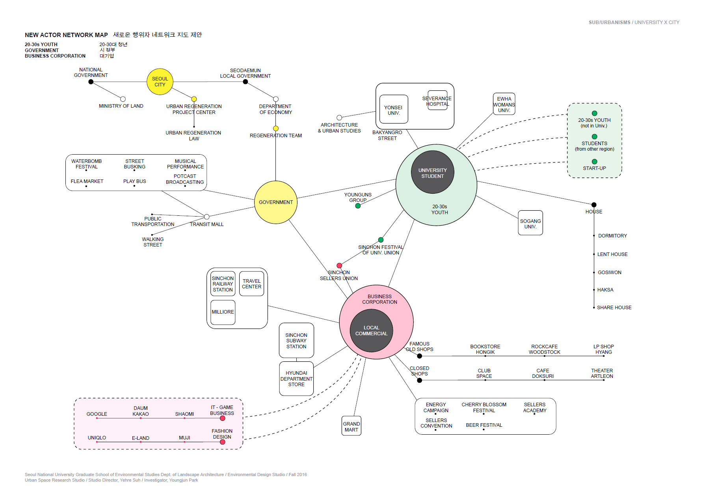
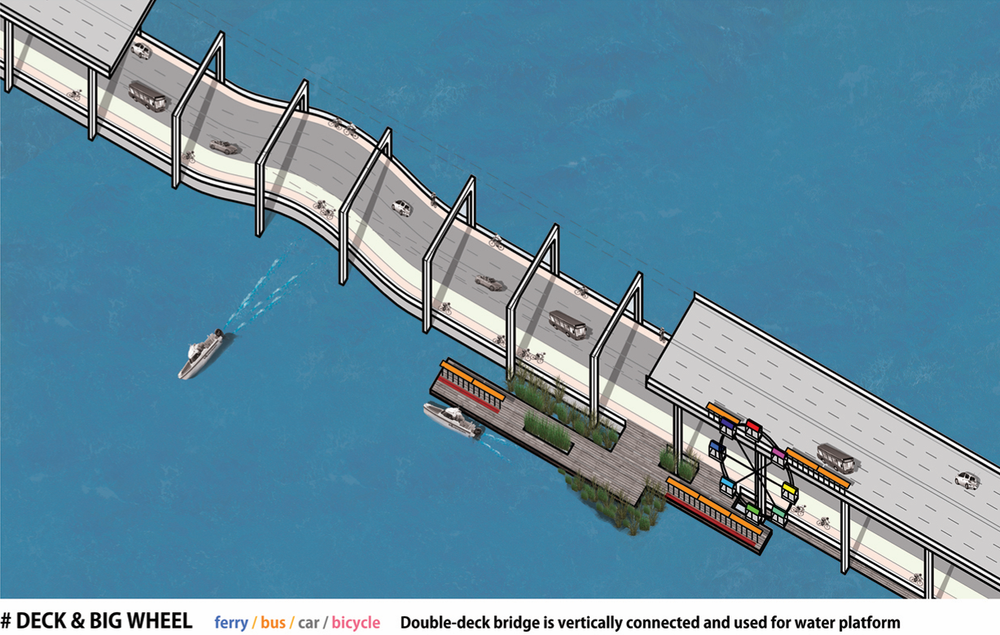
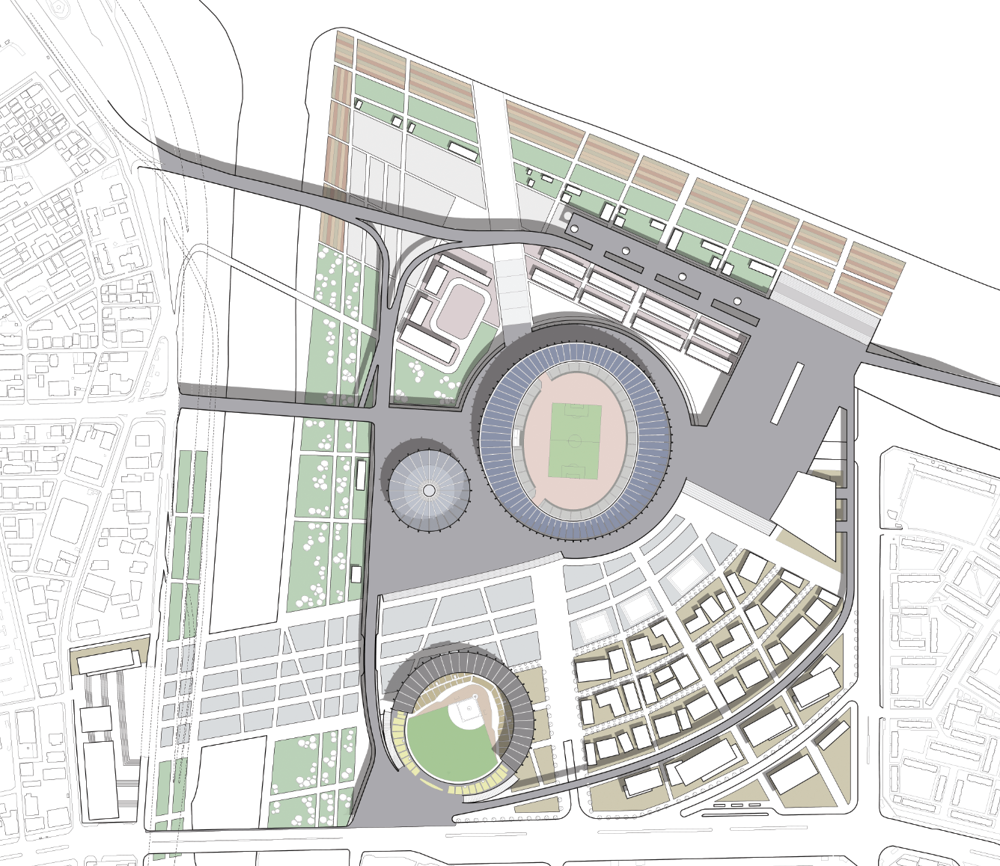
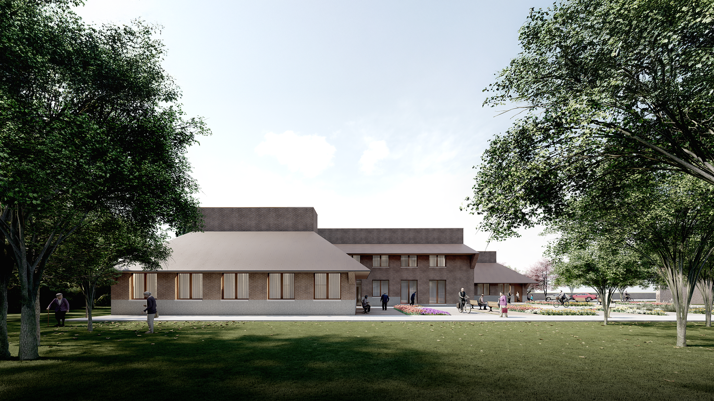
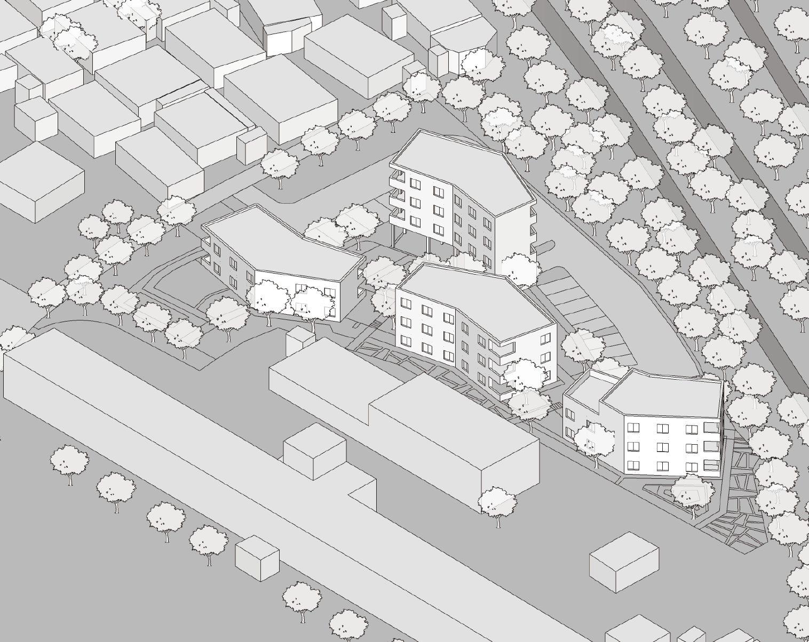

건축과 도시설계는 제 연구의 출발점이자, 연구의 성과를 다시 적용하는 실천의 장이기도 합니다. 석사 시절의 스튜디오 작업에서 출발하여 공모전, 사이드 프로젝트를 거쳐, 현재는 [ar-ge inc.](https://ar-ge.xyz) 에서 공공을 위한 건축과 공간을 설계하고 있습니다. 종이 위의 제안에서 실제 지어지는 건축으로, 개인 작업에서 팀 협업으로 이어지는 과정에서 설계가 마주하는 질문도 함께 변해왔습니다. 설계 과정에서 축적된 관찰은 다시 제 연구의 질문으로 되돌아갑니다.

---

## University X City

{fig-alt="신촌 지역 주요 행위자의 관계도 다이어그램"}

**Start-up Campus City: Economic Decline of Sinchon and Generative Potentials of Young People**

::: {.project-meta}
- **연도** · 2016
- **장소** · 신촌, 서울
- **유형** · 도시설계 · 석사 스튜디오
- **소속** · 서울대학교 공과대학 협동과정 도시설계학전공 · 석사 3학기
- **스튜디오** · 환경대학원 Environmental Design Studio
- **지도** · 서예례 (Studio Director)
- **역할** · 단독 연구·설계 (Investigator)
- **수상** · 서울대학교 환경대학원 도시설계 작품전 **최우수상**
:::

신촌은 한국 대학 문화의 상징적 장소였습니다. 1880년대 광혜원 의학교에서 시작된 고등교육 기관들이 집적되며 20세기 후반 청년 문화의 중심지로 성장했지만, 2000년대 이후 연세대 송도 캠퍼스 개설과 홍대 상권의 부상 속에서 지역 경제는 장기간 침체를 겪었습니다. 이 프로젝트는 **"신촌의 침체는 정말 경쟁 상권 문제인가, 아니면 청년들이 필요한 공간이 달라진 것인가"** 라는 질문에서 출발했습니다.

리서치 단계에서는 **신촌의 역사적 타임라인**, 주요 대학들의 재학생 추이, 신문 기사 분석, 그리고 현장 답사를 통해 지역의 경제적 쇠락과 청년층 변화를 추적했습니다. 흥미롭게도 당시 청년들은 학업 종료 후 사회 진출 단계에서 **창업 경험과 실무 교육의 부재** 를 가장 큰 어려움으로 꼽고 있었고, 이는 기존 대학 공간 안에서는 해소되기 어려운 요구였습니다.

이 관찰을 바탕으로, 서울시·신촌 상인회·주요 대학·패션/IT 대기업이 함께 운영하는 **'신촌 거리대학' (Shinchon Street College)** 을 제안했습니다. 청년들이 학교 밖에서 직접 제품을 만들고 판매하며 창업 노하우와 기술 교육을 받을 수 있는 분산형 캠퍼스 모델입니다. 신촌 지역을 4개의 설계 영역으로 나누어 각각 다른 주체와 프로그램을 배치했습니다.

- **MADE in sinchon** · 지역 상인과의 협업으로 제작·판매 공간
- **gonna be BIG** · 패션/IT 대기업과 교육 학원이 지원하는 멘토링 클러스터
- **OCCUPY the street** · 대학이 유휴 공간을 확보한 창업 가로
- **STAY our basecamp** · 인근 모텔과 주거 시설을 활용한 청년 체류 공간

본 프로젝트는 **대상지의 문제와 가능성을 분석하는 디자인 과정의 완성도** 를 평가받아 서울대학교 환경대학원 도시설계 작품전 최우수상을 수상했습니다. 설계 이후 신촌은 서울시의 도시재생 활성화 지역으로 지정되어 관련 공공사업이 진행되었으며, 이 스튜디오 작업은 이후 제 박사 연구에서 **물리적 공간과 청년 행태의 상호작용** 을 정량적으로 분석하는 연구 주제로 이어졌습니다.

---

## Running Everyday

{fig-alt="한강 다리 위 자전거 도로와 수상 교통 플랫폼을 연결하는 더블데크 교통 허브 투시도"}

**Re-interpreting the 1988 Seoul Olympic Marathon Course**

::: {.project-meta}
- **연도** · 2016
- **장소** · 서울 · 1988 올림픽 마라톤 코스 (여의도–강남–잠실)
- **유형** · 도시설계 · 국제 학생 공모전
- **공모전** · The 15th Korea–Japan–China International Students Conference for Landscape Architecture Design
- **역할** · 단독 출품 (Investigator)
:::

1988년, 187명의 마라토너들이 새로 개통된 서울의 도로를 달렸습니다. 여의도 · 강남 · 잠실을 잇는 이 코스는 당시 서울이라는 도시 자체를 세계에 선보이는 **상징적 경로** 였습니다. 2016년의 같은 도로는 다른 의미의 "달리기" 로 채워져 있습니다 — **매일 아침 수많은 사람들이 출퇴근으로 지쳐가는 고밀도 도심의 주요 간선**이 되어 있는 것입니다. 이 프로젝트는 **같은 공간이 스포츠 이벤트의 무대에서 일상의 압박 장치로 변한 시간의 전복**을 출발점으로 삼았습니다.

한·중·일 세 나라는 모두 올림픽 개최국(도쿄 1964, 서울 1988, 베이징 2008)이었고, 각 도시의 마라톤 코스는 자국의 대표적 경관을 세계에 보여주는 상징적 장치로 기능했습니다. 이 공모전은 2016년 시점에서 세 도시가 자신들의 마라톤 코스를 어떻게 다시 읽을 것인가를 묻는 자리였습니다.

서울 코스에 대한 제 해석은 **자동차 중심으로 포화된 이 회랑에 다양한 이동 수단의 결절점을 삽입하는 것** 이었습니다. 자전거, 지하철, 버스, 수상 택시, 페리 — 이미 서울에 존재하지만 서로 이어지지 않는 교통 수단들이 마라톤 코스의 주요 거점에서 만나도록 설계했습니다. "매일 달리느라 지친" 시민들에게 **잠시 멈추고 이어 탈 수 있는 그린 스테이션(GREEN station)** 을 제공하는 것이 핵심 아이디어입니다.

두 개의 모듈적 제안으로 구체화했습니다.

- **2×2 GREEN MODULE** · 버스전용차로와 자전거 정거장을 결합한 소규모 공원형 허브. 지하철 역 인근에 배치되어 지하–지상–자전거의 환승을 한 자리에 묶고, 회색 교통 인프라 사이에 작은 녹지를 확보합니다.
- **DECK & BIG WHEEL** · 한강 다리를 수직으로 적층하여 더블데크로 재구성. 상단은 차량 및 보행·자전거 도로, 하단은 수상 교통이 정박하는 플랫폼입니다. 수상 교통으로 도착한 사용자가 별도 이동 없이 다리 위 자전거 도로로 바로 이어 탈 수 있습니다.

프로젝트의 타이틀 **"Running Everyday"** 는 두 개의 달리기를 겹쳐 놓습니다 — 1988년의 마라토너, 그리고 오늘의 출근길 시민. 설계 제안은 이 회랑을 기념비가 아닌 **일상의 회복 장치** 로 재정의하려는 시도였습니다.

---

## Jamsil Sports Complex Reimagined

{fig-alt="잠실 종합운동장 일대의 리모델링 마스터플랜 평면도. 주경기장을 중심으로 서쪽 삼성동에서 동쪽 한강변까지 이어지는 데크 광장과 수변 공원의 구성이 보인다"}

**A First Urban Design Studio · Reconnecting the Stadium with the City**

::: {.project-meta}
- **연도** · 2015 (9월–12월)
- **장소** · 서울 잠실 종합운동장 일대
- **유형** · 도시설계 · 석사 스튜디오 · 첫 도시설계 작업
- **소속** · 서울대학교 공과대학 협동과정 도시설계학전공 · 석사 1학기
- **스튜디오** · 도시설계스튜디오 · 2 Urban Design Studio 2
- **지도** · 김세훈 (Studio Director)
- **역할** · 단독 연구·설계
:::

석사과정 첫 학기(2015년 가을)에 수행한, **제 첫 도시설계 스튜디오 작업** 입니다. 당시 서울시가 잠실 종합운동장 일대의 리모델링을 본격적으로 논의하기 시작하던 시점이었고, 이 프로젝트는 그 공공 담론에 학생으로서 제 나름의 안을 더해본 작업이었습니다.

잠실 주경기장은 엄청난 관객석 규모와 대지 면적에도 불구하고 도시적 맥락을 충분히 끌어안지 못하는 공간이었습니다. 사방이 간선 도로로 둘러싸여 있고, 한강변의 워터프론트는 어떤 쓰임새도 없이 방치되어 있었습니다. 유일하게 활성화된 진입은 남쪽 올림픽 단지 방향이었고, 일상적으로 기능하는 시설은 남쪽의 야구장 정도였습니다. 주경기장은 **도시 안의 거대한 고립된 땅**에 가까웠습니다.

제 제안의 핵심은 **서쪽 삼성동 방향으로 새로운 주 진입을 열어 주경기장과 한강을 관통하는 축을 만드는 것** 이었습니다.

- **서–동 축의 데크 광장** · 기존 도로에서 차량으로 접근 가능한 데크가 주경기장을 감싸며 한강변까지 이어집니다. 기존의 남북 진입 축에 수직한 새로운 흐름을 만들어, 주경기장과 야구장이 하나의 연속된 활성 영역이 되도록 했습니다.
- **탄천 하천변의 진입 광장** · 탄천에서 경기장 일대로 올라올 수 있는 대형 광장. 보행·자전거 접근성을 크게 확장합니다.
- **한강변 수변 활성화** · 도시 농업과 관객용 수변 공원을 배치하여, 경기가 없는 날에도 한강변이 상시 사용되도록 합니다.
- **운영 동선과 시민 동선의 분리** · 경기장 부속 시설은 새로운 데크 아래에 배치하여 시민의 보행 경험을 방해하지 않도록 했습니다.
- **남동쪽 상업 용지** · 새롭게 확보한 상업 프로그램으로 경기장 일대를 **스포츠 이벤트가 없어도 매일 방문할 수 있는 상업 거리** 로 재정의했습니다.

첫 도시설계 작업이었던 만큼 해법보다는 **"도시 맥락을 읽어내는 방식"** 을 배우는 과정이 더 컸습니다. 경기장이라는 특수 건축 유형이 도시 속에서 고립되는 일반적 현상을, 접근성과 축의 재편으로 풀어보려 했던 첫 시도입니다. 이후 석사·박사로 이어지는 도시설계 연구의 **시작점** 이 된 프로젝트이기도 합니다.

---


## 강화 우리 마을 · 발달장애 노인 그룹홈

{fig-alt="벽돌 마감의 단층 건물 외관 렌더링. 공원의 잔디밭과 화단, 나무 사이로 건물이 배치되어 있고, 주민들이 산책하거나 벤치에 앉아 쉬고 있는 장면"}

**A Residential Care Home for Elderly Adults with Developmental Disabilities**

::: {.project-meta}
- **연도** · 2024– · *진행 중 · 시공 착수*
- **장소** · 강화도
- **클라이언트** · 사회복지법인 우리마을
- **유형** · 건축 · 복지 시설 · 신축
- **역할** · **대지 분석 · 컨셉 설계 · 배치 계획** (ar-ge inc. 팀 작업)
- **상태** · 실제 시공 착수 — 제가 설계에 참여한 프로젝트 중 첫 실제 건축물
:::

*[ar-ge inc.](https://ar-ge.xyz) 에서 진행 중인, 제가 설계에 참여한 프로젝트 중 **처음으로 실제 지어지는 건축물** 입니다. 클라이언트인 '강화 우리 마을'은 발달장애인들을 어릴 때부터 오랜 세월 보살펴온 사회복지법인입니다. 그 분들이 함께 성장하여 이제 노년기에 접어들며, 생애 내내 지내온 공동체 안에서 노년을 이어갈 수 있는 **발달장애 노인 전용 그룹홈** 이 필요하게 되었습니다. 이 프로젝트는 그 요청에서 출발했습니다.

설계의 핵심 결정은 단순합니다 — **기존 건물을 그대로 유지하고, 새 건물을 그 옆에 조심스럽게 놓는 것.** 이용자들이 생애 내내 살아온 공간의 기억은 노년기에 오히려 더 중요해집니다. 새로운 시설로 옮겨가는 것이 아니라 **익숙한 장소의 연장** 으로 느낄 수 있도록, 기존 건축물과의 관계를 설계의 출발점으로 삼았습니다. 배치 계획 단계에서 기존 건물의 방향성과 진입 동선을 면밀히 분석하여, 새 건물이 기존 건물과 자연스러운 마당을 형성하도록 조정했습니다.

건축의 디테일 역시 **기존 건축물과 호응하는 재료와 질감** 으로 결정되었습니다. 벽돌 마감의 톤, 지붕의 형태, 창호의 비례 — 새 건물이 두드러지지 않고 기존 장소에 녹아들도록 하는 작업이었습니다. 거주자들의 일상이 이 공간에서 자연스럽게 이어질 수 있도록, 건물 앞의 공원과의 관계 역시 설계 초기 단계부터 함께 고려했습니다.

이 프로젝트는 제가 학생 시절부터 이어온 설계 작업들과는 다른 층위의 경험입니다. 제안이 아니라 **실제 세워지는 건축** 이며, 그 공간 안에서 구체적인 사람들이 삶을 이어갈 것이라는 사실이 설계의 모든 결정에 무게를 더했습니다. ar-ge inc. 팀과 함께, 대지 분석에서 컨셉, 배치까지 설계 초기 단계 전반에 참여했습니다.

---

## 단양 행복올래 플랫폼 · 감싸 안는 집

{fig-alt="꺾인 형태의 매스가 외부 공간을 감싸 안는 공동주택 단지의 아이소메트릭 뷰. 경사지에 맞춰 건물 높이가 변화한다"}

**A Public Housing Proposal that Embraces the Landscape**

::: {.project-meta}
- **연도** · 2024
- **장소** · 충청북도 단양군
- **유형** · 건축 · 공공 공동주택 · 설계 공모전
- **공모전** · 단양군 행복올래 플랫폼 공동주택 설계 공모
- **역할** · **대지 분석 · 기본 설계** (ar-ge inc. 팀 작업)
- **결과** · **입상작 선정**
:::

*[ar-ge inc.](https://ar-ge.xyz) 에서 참여한 공공 공동주택 설계 공모전입니다. 한국의 공동주택은 대부분 **획일적이고 균일한 볼륨** 으로 지어집니다. 같은 평면, 같은 높이, 같은 배치가 전국 어디서나 반복됩니다. 이 프로젝트는 그 관성을 거스르려는 시도였습니다.

대상지의 경사를 그대로 받아들이는 것이 첫 결정이었습니다. 평지화해서 동일한 높이의 건물을 세우는 대신, **지형의 높낮이에 따라 건물의 층수를 조정** 했습니다. 그 다음, 평면을 직선으로 배열하는 대신 **중앙에서 꺾이는 매스** 로 구성했습니다. 이 꺾임이 만드는 효과가 작품의 제목 — **'감싸 안는 집'** — 그대로입니다. 네 동의 건물이 각기 다른 각도로 꺾이며 중심의 외부 공간을 **안쪽으로 품는** 배치가 됩니다. 주민들은 사방으로 열린 외부가 아니라 공동체가 공유하는 **감싸인 마당** 을 갖게 됩니다.

평면에서도 단순한 반복을 피했습니다. 꺾인 지점의 내부 공간을 **수직 동선과 보조 기능 실** 로 구성하여, 가족 구성이나 라이프스타일이 바뀌어도 유연하게 적응할 수 있도록 설계했습니다. 공동주택이 평생 거주지가 될 수 있다는 현실적 요구에 대한 한 가지 응답입니다.

이 프로젝트에서 저는 대상지 분석과 기본 설계 단계에 참여했습니다. 작업 과정에서 **공공을 위한 시설과 공간이 어떠해야 하는지에 대한 ar-ge 팀 내부의 깊은 토론** 이 오랫동안 기억에 남습니다. 공모전의 1등을 차지하지는 못했지만 입상작으로 선정되어, 이러한 접근이 설계 심사에서도 의미 있게 받아들여졌다는 확인을 받은 작업이었습니다.

---

## Deliberation Field

```{=html}
<video autoplay loop muted playsinline width="100%" aria-label="Deliberation Field — 수천 개의 점이 모이고 흩어지며 군집을 이루는 미디어 아트 화면 기록">
  <source src="assets/images/design/deliberation-field-loop.mp4" type="video/mp4">
</video>
```

**Place Hearing on an N-Dimensional Vector Space**

::: {.project-meta}
- **연도** · 2026
- **장소** · PG Galerie, 베를린
- **전시** · 《Da:zwischen》 · 2026.7.25 – 7.30
- **유형** · 미디어 아트
- **매체** · LLM 소셜 시뮬레이션 · 텍스트 임베딩 · p5.js
- **역할** · 단독 작업 · 개인 자격 참여
- **링크** · [인터랙티브 웹 (Deliberation Field — Berlin)](https://youngjour.github.io/p5-placehearing/berlin)
:::

우리가 공유하는 도시와 공공건축은 한 사람의 결정이 아니라 여러 사람의 논의와 상호 이해를 거쳐 만들어져야 합니다. 이 작품은 그 과정 자체를 다루는 미디어 아트입니다. 제목의 Hearing에는 두 가지 뜻을 겹쳐 두었습니다 — 장소의 미래를 결정하는 제도로서의 공청회(Public Hearing), 그리고 그 장소에 얽힌 수많은 목소리에 귀 기울여 듣는 일(Hearing).

출발점은 실제 관찰이었습니다. 농촌 지역의 주민 공청회를 지켜보며, 고령화된 지역에서 장기 공공계획에 대한 의견을 모으고 소통하는 일이 얼마나 어려운지를 보았습니다. 이후 가상의 주민 에이전트들이 계획안을 논의하는 시뮬레이션을 연구로 다루게 되었고, 에이전트들의 의견이 움직이고 서로 영향을 주고받는 모습을 여러 차례 지켜본 경험이 이 작품의 재료가 되었습니다. 한국 인구통계에 근거해 구성한 가상 주민 100인이 각자의 가치관으로 하나의 계획안에 반응하고, 그 발화들이 임베딩 공간 위에 점으로 놓입니다.

다만 이 작품은 데이터 시각화가 아닙니다. 연구에서 영감을 받았지만, 미술적 표현을 위해 많은 것을 수정했습니다. 데이터를 그대로 옮기는 대신, 사회자·발언자·방청객 사이의 관계와 의견의 이동을 표현하는 데 집중했습니다. 점들이 모이고 흩어지는 움직임에서 사람들의 의견이 서로 동조하고, 반발하고, 때로 소용돌이치는 상호작용이 떠오르기를 바랐습니다.

전시 도입부에는 가상 주민들의 가치 구조를 보여주는 보조 작품 두 점 — <두 사람>과 <공청회의 100인> — 이 함께 놓입니다. 관람객은 인터랙티브 웹에서 점들 사이에 숨은 실제 문장들을 직접 읽을 수 있습니다.
